## Use Jenkins to Deploy a Hypothyroid Machine learning Application 

### (Udacity AWS DevOps Nano degree Capstone Project)

### Propose and Scope the Project

The Continuous Integration, Continuous Deployment or Continuous Delivery (CI/CD) is very important for the software development and production as scale. Jenkins is one of popular CI/CD tool for that. This Project uses Jenkins to build and deploy a machine learning application via docker and AWS kubenetes Service.

The outline of the steps for this project

1. Build an Machine Learning flask app.  

* I have built hyothyroid classification app previously with flask [link](https://github.com/Jun-depo/hypothyroid_flaskapp).  The app is slightly modified for this project.

2. Build docker image version 1 of the app, then deposit it at docker hub.  

3. Deploy kubenetes service with version 1 of the docker image (tagged V1). 

4. Modify the flask app to build and deposit version 2 of the docker image (tagged V2). 

5. Use kubenetes services to perform rolling update with new version of the docker image. 

All the steps above were scripted inside Jenkinsfile which integrated the whole development and production processes. Jenkinsfile perform tasks as stages.  
 I will discuss these stages in the following sections.

### Install Jenkins, awscli, blue ocean plugin etc

* Install these software following [the reference](https://andresaaap.medium.com/how-to-install-docker-aws-cli-eksctl-kubectl-for-jenkins-in-linux-ubuntu-18-04-3e3c4ceeb71).  

* After lauching Jenkins at localhost:8080.  Need to install plugins and add AWS credentials and dockerhub credentials as described in [the reference](https://andresaaap.medium.com/how-to-install-docker-aws-cli-eksctl-kubectl-for-jenkins-in-linux-ubuntu-18-04-3e3c4ceeb71).  

### Stage "Linting"

* This stage was to detect mistakes in python with pylint and Dockerfile files with hadolint.  As show in the following pictures, app.py contained the mistake and failed the linting stage.

 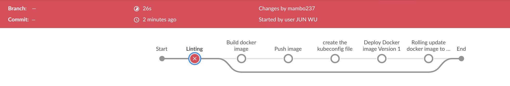

 

* After correcting this mistake, the pipeline went through without out the problem.  

### Stage "Build docker image" and 

* Docker image was built based on Dockerfile.  I also included .dockerignore to exclude files copying into the container.  

* In addition, I added conditional parameter inside Jenkinsfile to control when to build and push docker image to dockerhub.  Similarly, this can also be used to control rolling update.The pictures below show an example this selection method. 

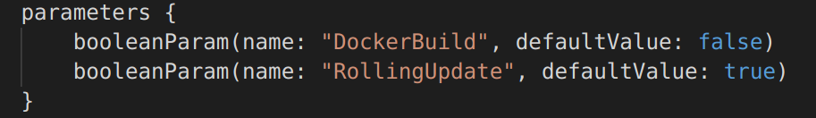

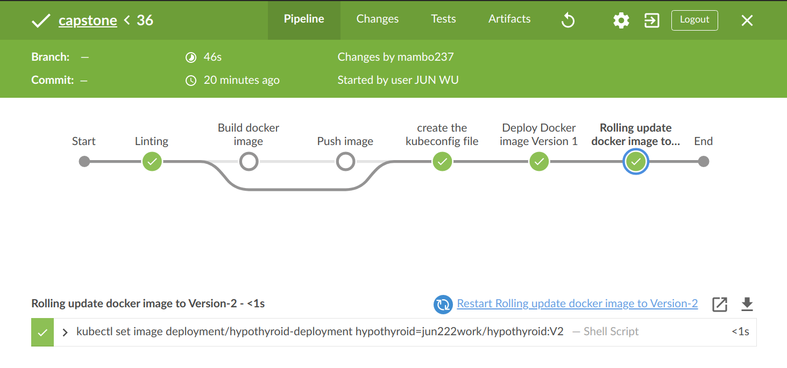

* The docker image was tagged with version such as V1 or V2.  I specify an environmnent as environment { NEW_VERSION = "V2" }, use $NEW_VERSION to tag the docker image. 

### Stage 'Push image'
* Push image to dockerhub. So, it can be used for kuibenetes deployment.  This required dockerhub credential in Jenkins to interact with dockerhub.

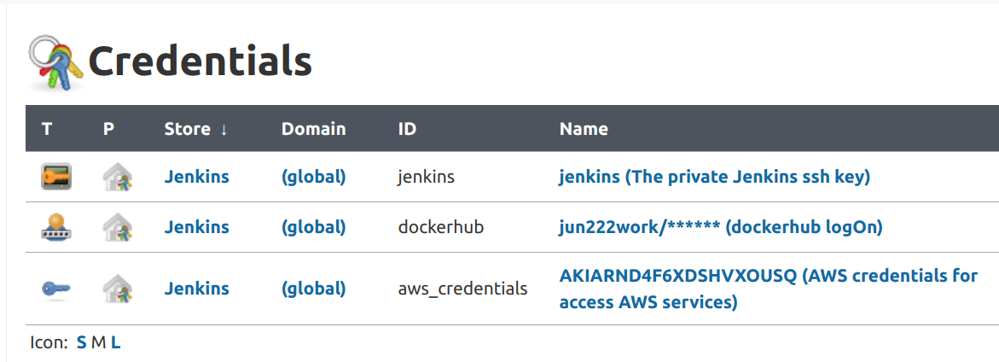

### Create Kubenetes Cluster with AWS EKS

* This was done outside Jenkinsfile. I used the following command to create kubenetes cluster. 
* eksctl create cluster --name capstonecluster --region us-east-1 --with-oidc --ssh-access --ssh-public-key udacity --managed

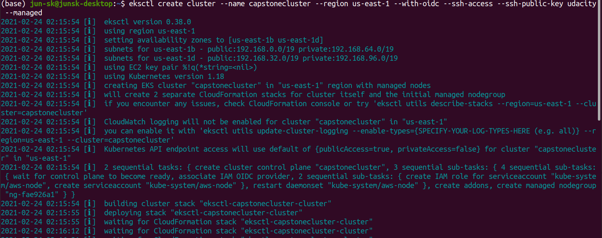

* EKS automatically configures the required resources and permissions to create the cluster.  This creates 3 cloudformation stacks with the resources associate with them. 

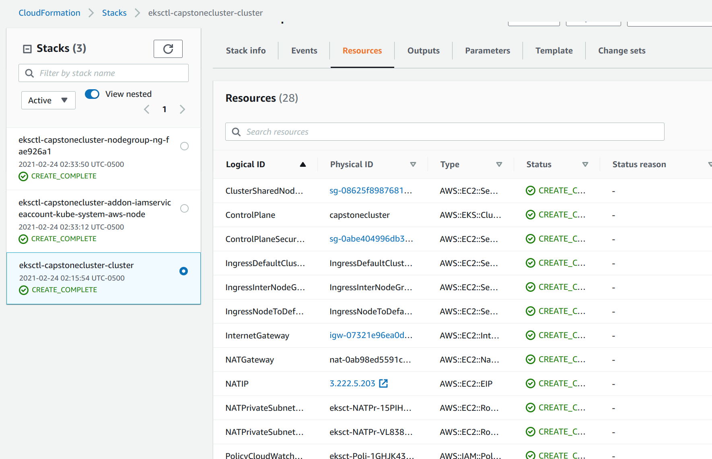

Launched kubenetes clusters inculdes two EC2 instances that belong to the capstonecluster. 

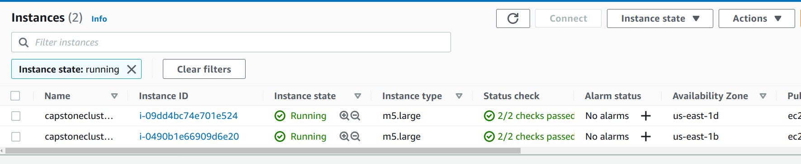

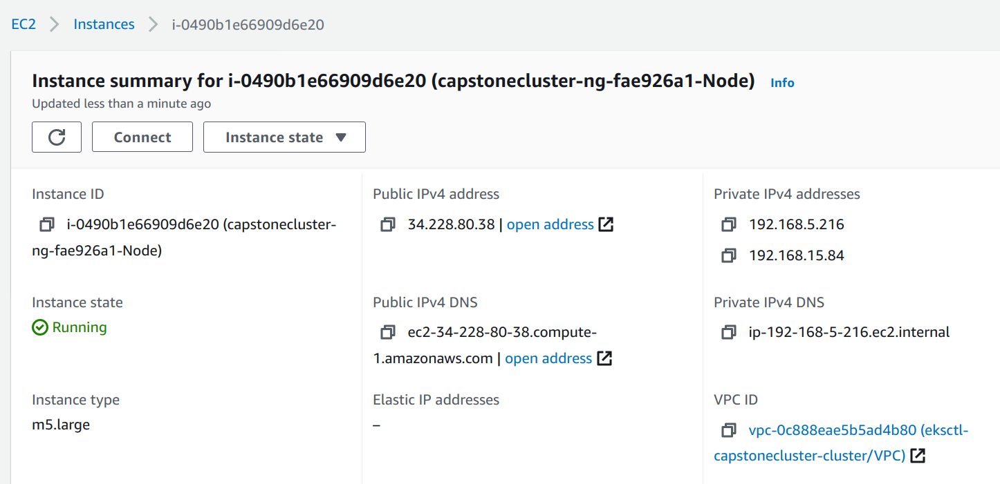

Alternative, one can configure their own kubenetes cluster through their own Cloudformation scripts.  

### stage 'create the kubeconfig file'
* This create kubeconfig file, required for later kubenetes deployment. 

### stage('Deploy Docker image Version 1')

* I used deployment_service.yaml to deploy the docker application and service (loadbalancer).  This requires AWS credential stored inside Jenkins. The default docker image was tagged as V1 (inside deployment_service.yaml).  

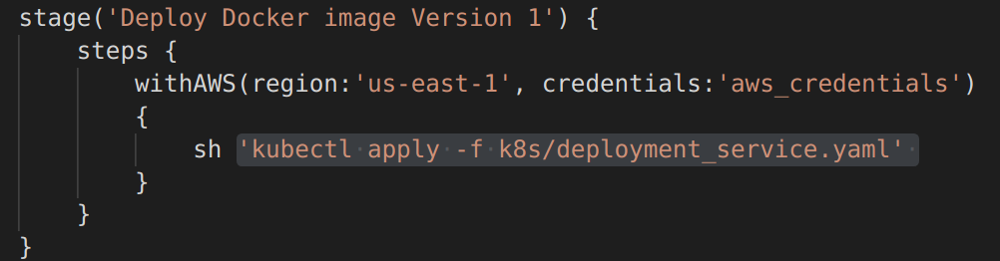

The first deployment skipped the following rolling update stage as shown in the Blue Ocean pipeline CI/CD picture. 

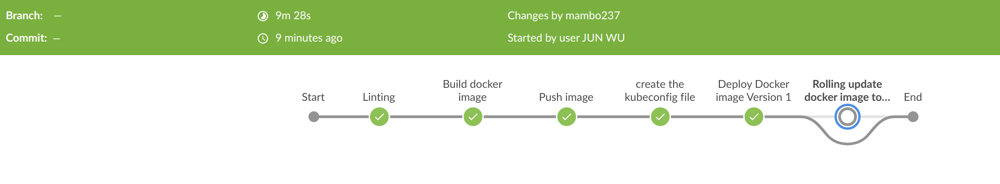

* The DNS can be used for the web access to the app, which can be obtained via CLI  "kubectl get svc". In this way, we can access the app through the web interface (http://a22e202dc0b9d49478bf701a8b655164-1513508813.us-east-1.elb.amazonaws.com/ )

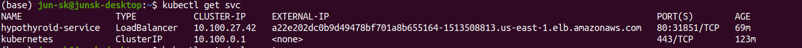

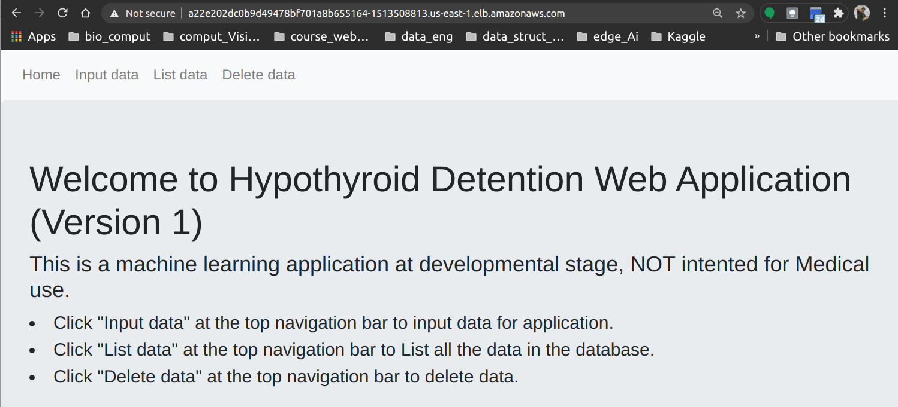

### stage('Rolling update docker image to Version-2')

I used "kubectl set image" method for the rolling update.  I tagged the docker image with $NEW_VERSION.  As NEW_VERSION was set as "V2". It updated app to V2.  It could be used to tag any version as long as a tagged version exist at dockerhub.  One of good practices is to tagged docker image with first 6 or 8 letters of git commit. So, it is easier to associate each image to code base of a particular commit. The rolling update resulted the app switched from version 1 to version 2 as shown in the pictures below.  

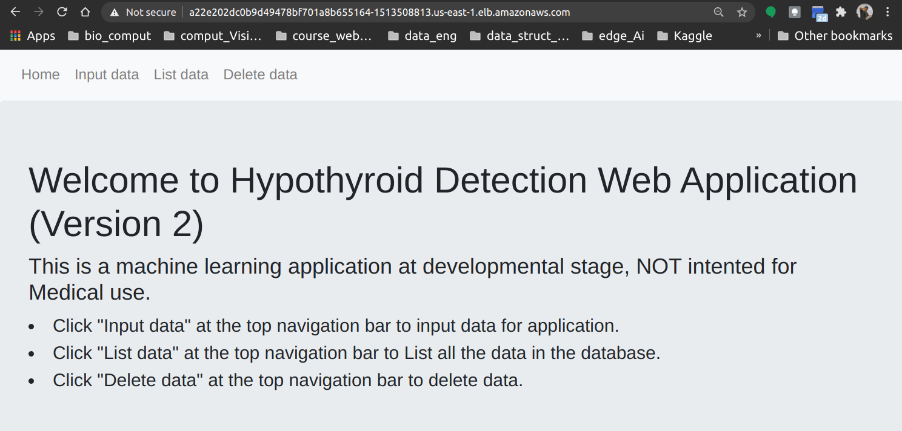

### Successfully running the entire CI/CD pipeline

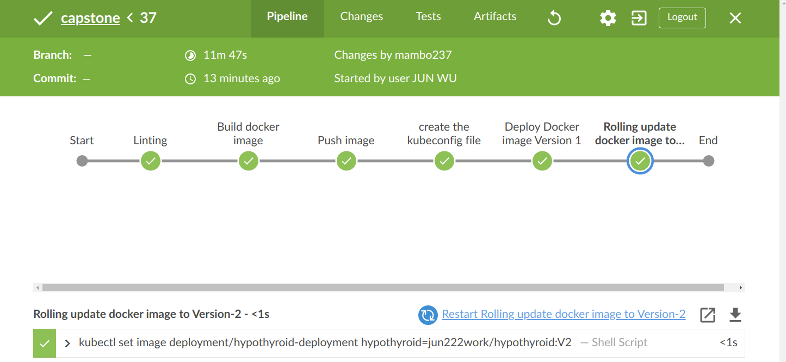

### Dev Environment

Ubuntu 20.04
aws-cli/1.18.69 Python/3.8.5 Linux/5.8.0-43-generic botocore/1.16.19
kubectl v1.20.2
eksctl 0.38.0

### Further Reading

The following links were very helpful for the project. Thanks, Alvaro Andres Pinzon Cortes for writing them.  

https://andresaaap.medium.com/capstone-cloud-devops-nanodegree-4493ab439d48

https://andresaaap.medium.com/simple-blue-green-deployment-in-kubernetes-using-minikube-b88907b2e267

https://andresaaap.medium.com/how-to-configure-and-execute-a-rolling-update-strategy-in-kubernetes-5e662be968b

