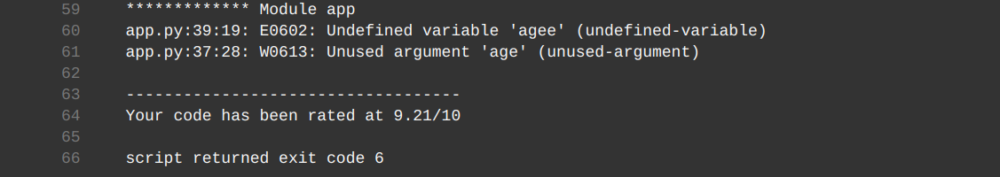

## Use Jenkins for Continuous Integration, Continuous Deployment or Continuous Delivery (CI/CD) to Deploy a Hypothyroid Machine learning Application (Udacity AWS DevOps Nano degree Castone Project)

### Propose and Scope the Project

This Project use Jenkins as the CI/CD tool to build the Docker image for a machine learning application, then use AWS kubenetes Service to deploy the application using the docker image.

The outline of the steps for this project

1. Build an Machine Learning flask app.  

* I have built hyothyroid classification app previously with flask [link](https://github.com/Jun-depo/hypothyroid_flaskapp).  The app is slightly modified for this project.

2. Build docker image version 1 for this app and deposit at docker hub.  

* Dockerfile contains the info to build docker image.

3. Deploy kubenetes service with version 1 of the docker image (tagged V1). 

4. Modify the flask app to build and deposit version 2 of the docker version (tagged V2). 

5. Use kubenetes services to perform rolling update with new docker image. 

All the steps above were scripted in Jenkinsfile which perform the tasks in stages.  I will discuss these stages in the following sections.

### Install Jenkins, awscli, blue ocean plugin 

* Install these software following [the reference](https://andresaaap.medium.com/how-to-install-docker-aws-cli-eksctl-kubectl-for-jenkins-in-linux-ubuntu-18-04-3e3c4ceeb71).  

* After lauching Jenkins at localhost:8080.  Need to install plugins and add AWS credentials and dockerhub username and password as described in [the reference](https://andresaaap.medium.com/how-to-install-docker-aws-cli-eksctl-kubectl-for-jenkins-in-linux-ubuntu-18-04-3e3c4ceeb71).  

### Stage "Linting"
Detect mistakes in python files.  As show in the following pictures.

 

 

After this mistake, the pipeline went through without out the problem.  

### Stage "Build docker image" and 

* Docker image is built based on Dockerfile.  I also included .dockerignore to exclude files copying into the container.  

* In addition, I added conditional parameter inside Jenkinsfile to control when to build and push docker image Similarly, this also can be used to control Rolling update.The pictures below show an example this selection method. 

The docker image was tagged with version such as V1 or V2.  I specify an environmnent as environment { NEW_VERSION = "V2" }, use $NEW_VERSION to tag the docker image

### Stage 'Push image'
* Push image to dockerhub that can be used for kuibenetes deployment.  This required dockerhub credential in Jenkins to interact with 

### Create Kubenetes Cluster with AWS EKS
* This was done outside Jenkinsfile. I used the following command to create kubenetes cluster. 
* eksctl create cluster --name capstonecluster --region us-east-1 --with-oidc --ssh-access --ssh-public-key udacity --managed

* EKS automatically configures the required resources and permissions to create the cluster.  This creates 3 cloudformation stacks with the resources associate with them. 

### stage 'create the kubeconfig file'
* This create kubeconfig file for later deployment

### stage('Deploy Docker image Version 1')

* I used deployment_service.yaml to deploy the docker application and service (loadbalancer).  This requires AWS credential stored inside Jenkins. The default docker image was tagged with V1 (inside deployment_service.yaml).  

The first deployment skipped the following rolling update stage as shown in the Blue Ocean pipeline CI/CD picture. 

